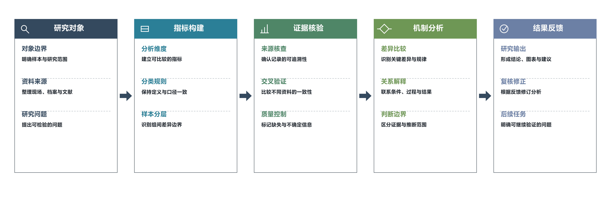

# draw-process-flowchart

一个可复用的论文级流程图绘制 Skill。它保留参考图的视觉系统，但不限定研究主题、阶段数量或栏数。

## 能力

- 支持 2–6 个阶段，以及横向、纵向布局；
- 支持自定义阶段标题、分组文字、图标和底部流程带；
- 统一使用色块标题、实心箭头、虚线分隔和 Microsoft YaHei 字体；
- 导出 PNG、SVG、PDF，并提供独立图和文稿嵌入后的检查清单。

## 示意效果

下面是根据本 Skill 重新拟定的科研证据链示意图，不对应任何个人论文或真实数据：



它展示了 5 阶段横向布局、科研过程分组、统一线性图标、虚线分隔和实心箭头等效果。对应的 SVG、PDF 也放在同一 `assets/` 目录中。

## 在 Codex 中调用

```text
$draw-process-flowchart
```

例如：

```text
用 $draw-process-flowchart 把这段研究方法整理成 5 阶段横向流程图，使用微软雅黑并导出 PNG、SVG、PDF。
```

## 本地模板

模板脚本位于 `scripts/draw_flowchart_template.py`，风格参数位于 `references/style-spec.md`。默认会读取本机的 Microsoft YaHei 常规与粗体字体；如果字体路径不同，可通过命令行参数显式传入。

```bash
python3 scripts/draw_flowchart_template.py \
  --orientation horizontal \
  --output-dir ./output \
  --stem process_flowchart \
  --bottom-labels 输入 分析 执行 反馈
```

## 目录结构

```text
SKILL.md                         # Skill 主说明
agents/openai.yaml               # Codex 显示名称与默认提示词
references/style-spec.md         # 色彩、字体、布局和 QA 规范
scripts/draw_flowchart_template.py
```
